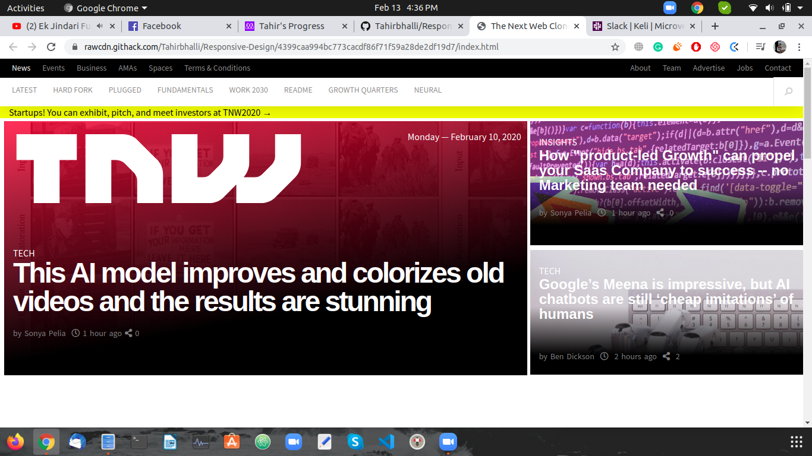

# Building Responsive Design

The page is a mock up of [this](https://thenextweb.com/) page.  

## Built With

- Html
- CSS

## Live Demo

[Live Demo Link](https://rawcdn.githack.com/Tahirbhalli/Responsive-Design/571f254b514e40f6ecb52c60fd690d5f8c8799e8/index.html)

## Authors

👤 **Author1**

- Github: [@davisdambis](https://github.com/davisdambis)

👤 **Author2**

- Github: [@tahirbhalli](https://github.com/tahirbhalli/)

## 🤝 Contributing

Contributions, issues and feature requests are welcome! Start by:
* Forking the project
* Cloning the project to your local machine
* `cd` into the Youtube-Replica project directory
* Run `git checkout -b your-branch-name`
* Make your contributions
* Push your branch up to your forked repository
* Open a Pull Request with a detailed description to the development branch of the original project for a review

## 📝 License

This project is [MIT](https://opensource.org/licenses/MIT) licensed.
